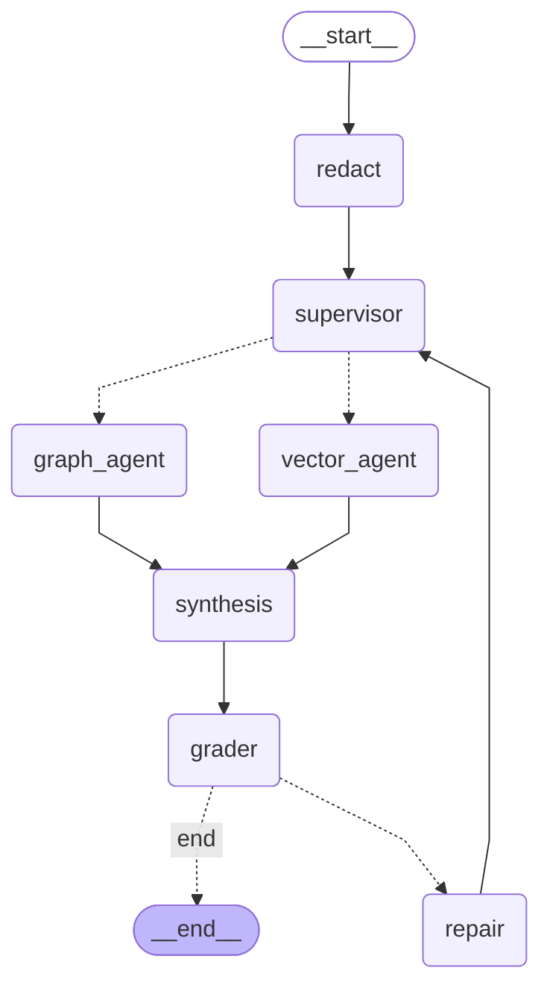

# Agent graph (generated)

```mermaid
---
config:
  flowchart:
    curve: linear
---
graph TD;
	__start__([<p>__start__</p>]):::first
	redact(redact)
	supervisor(supervisor)
	graph_agent(graph_agent)
	vector_agent(vector_agent)
	synthesis(synthesis)
	grader(grader)
	repair(repair)
	__end__([<p>__end__</p>]):::last
	__start__ --> redact;
	grader -. &nbsp;end&nbsp; .-> __end__;
	grader -.-> repair;
	graph_agent --> synthesis;
	redact --> supervisor;
	repair --> supervisor;
	supervisor -.-> graph_agent;
	supervisor -.-> vector_agent;
	synthesis --> grader;
	vector_agent --> synthesis;
	classDef default fill:#f2f0ff,line-height:1.2
	classDef first fill-opacity:0
	classDef last fill:#bfb6fc
```
